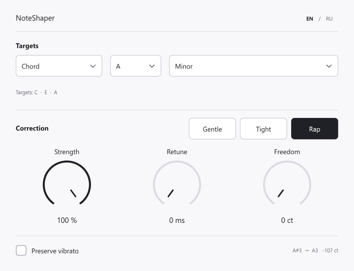

# NoteShaper

[English](README.md) · [Полная инструкция](docs/USER_GUIDE.ru.md) · [Сборка из исходников](docs/BUILD.ru.md)

[Поддержать автора](https://www.donationalerts.com/r/lesha_diabet_)

Открытый плагин коррекции высоты одного голоса для **Windows x64 / VST3**. Выбери ноту, аккорд, гамму или свой набор и настрой жёсткий эффект либо аккуратную подтяжку. Три крутилки постоянно доступны на одном экране.

## Скачать и установить

Готовая версия находится в [Releases](https://github.com/alexeyPetrushin/NoteShaper/releases/latest).

- **NoteShaper-0.5.1-vst3.zip** — плагин VST3 и инструкции.
- **NoteShaper-0.5.1-full.zip** — VST3, отдельное приложение, исходники, проверки и архив исходников JUCE.

Распакуй архив и закрой Ableton. Скопируй **всю папку** `VST3/NoteShaper.vst3` в `C:\Program Files\Common Files\VST3`, затем пересканируй VST3 в Ableton. Копирования одного файла DLL недостаточно. При обновлении с NoteFollow используй [инструкцию](docs/USER_GUIDE.ru.md#установка).

## Возможности

- Одна нота, аккорд, гамма, собственный набор или ноты из MIDI.
- Мажор, натуральный и гармонический минор, мажорная и минорная пентатоника.
- Три крутилки: **сила**, **время подтяжки**, **допуск**.
- Настройки «Мягко», «Плотно», «Рэп» и режим «Сохранить вибрато».
- MIDI-педаль sustain, независимые каналы и корректное отпускание нот.
- Моно и стерео; светлый почти монохромный интерфейс.
- Английский по умолчанию; **EN / RU** справа вверху переключает язык и сохраняет выбор в проекте.

## Что учитывать

Плагин рассчитан на **один голос без аккомпанемента**, примерно 65–1000 Гц. Задержка обработки — **64 мс**: версия прежде всего подходит для записанного вокала. Время подтяжки регулирует плавность коррекции и не уменьшает эту задержку.

На шумном, хриплом и придыхательном вокале и при больших скачках возможны артефакты. Автоматического определения тональности, гармонизации, редактора отдельных нот и ручек формант/транспонирования нет. Синтетические проверки не доказывают одинаковое звучание с коммерческими движками.

[Проверки](docs/VALIDATION.md) · [Оформление](docs/DESIGN.md) · [Изменения](CHANGELOG.md)

Прежние идентификаторы VST3 и первые 18 параметров NoteFollow сохранены для старых проектов. В сканируемых папках должна находиться одна версия плагина.

## Лицензия

[GPL-3.0](LICENSE.txt). Использована JUCE 7.0.12 с её GPL/коммерческими условиями. Архив исходников библиотеки и лицензионные уведомления включены в полный релиз; см. [сторонние зависимости](ThirdParty/README.md).
